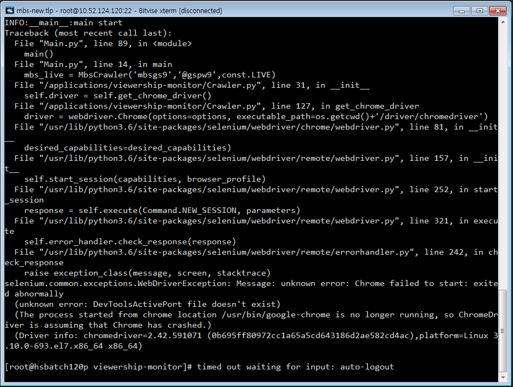

### Selenium에서 서버에 설치된 Chrome과 호환되지 않는 Chromedriver로 실행할 경우 에러가 발생한다.
> 서버에 설치된 Chrome 브라우저를 Selenium headless 모드로 실행하면 아래와 같은 에러가 발생한다.

### Chrome version별 호환 Chromedriver 버전
**Current Releases**
- If you are using Chrome version 73, please download ChromeDriver 73.0.3683.20
- If you are using Chrome version 72, please download ChromeDriver 2.46 or ChromeDriver 72.0.3626.69
- If you are using Chrome version 71, please download ChromeDriver 2.46 or ChromeDriver 71.0.3578.137