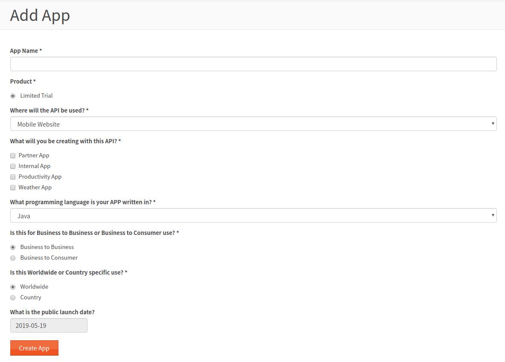

## 서비스 화면별 기능
### 온도 그래프
- 평균최고, 평균최저
- 고온(현재),저온(현재)
- 고온(예상),저온(예상)

### 월간 예보
- 기온
- 기후 : 맑음, 구름, 비

### AIR QUALITY
- 현재 공기질 지수
- 최근 4시간 공기질 변화 
- PM10,PM2.5,CO,NO2,SO2

### 건강지표
- 식중독지수
- 천식 폐질환 지수
- 뇌졸중 지수
- 감기 지수
- 나무 꽃가루 농도

## API 사용
### Application 등록하기
- Add a new app

### API Key 받기
- MyApps 메뉴에 등록한 앱 확인하기

### API Reference
#### Locations API
- Admin Area List
  - Returns basic information about administrative areas in the specified country.
    >http://dataservice.accuweather.com/locations/v1/adminareas/{countryCode}  

- Country List
  - Returns basic information about all countries within a specified region.
    > http://dataservice.accuweather.com/locations/v1/countries/{regionCode}
- Region List
  - Returns basic information about all regions.
    > http://dataservice.accuweather.com/locations/v1/regions
- Top Cities List
  - Returns information for the top 50, 100, or 150 cities, worldwide.
    > http://dataservice.accuweather.com/locations/v1/topcities/{group}

#### Forecast API
**일별**
- 1 Day of Daily Forecasts
  > http://dataservice.accuweather.com/forecasts/v1/daily/1day/{locationKey}
- 5 Days of Daily Forecasts
  > http://dataservice.accuweather.com/forecasts/v1/daily/5day/{locationKey}
- 10 Days of Daily Forecasts
  > http://dataservice.accuweather.com/forecasts/v1/daily/10day/{locationKey}
- 15 Days of Daily Forecasts
  > http://dataservice.accuweather.com/forecasts/v1/daily/15day/{locationKey}

**시간별**

- Current Conditions
  >http://dataservice.accuweather.com/currentconditions/v1/{locationKey}
- Historical Current Conditions (**past 24 hours**)
  >http://dataservice.accuweather.com/currentconditions/v1/{locationKey}/historical/24
- Historical Current Conditions (**past 6 hours**)
  >http://dataservice.accuweather.com/currentconditions/v1/{locationKey}/historical