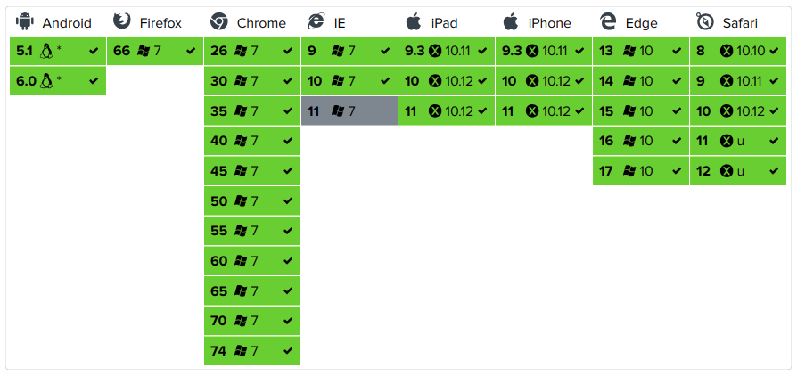
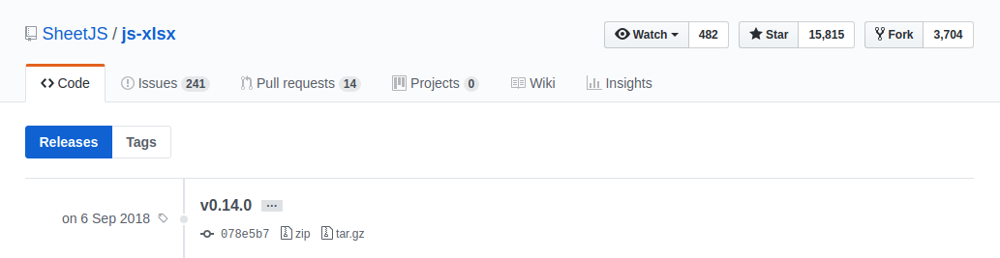

이번 포스트에는 프론트엔드에서 SheetJS를 사용하는 방법을 정리해 보았습니다.

### SheetJS - Home
[링크](https://github.com/SheetJS/js-xlsx/releases)

#### 브라우저 테스트
모든 버전을 지원하진 않으므로, 사용환경에 맞춰서 개발을 고려해야 함.


#### Installation
스크립트 선언 
```javascript
<script lang="javascript" src="dist/xlsx.full.min.js"></script>
```

With <span style="color:red;">&nbsp;npm:</span>
```bash
npm install xlsx --save
```

With <span style="color:red;">&nbsp;bower:</span>
```bash
bower install js-xlsx
```

With <span style="color:red;">&nbsp;CDN:</span>
> CDNjs automatically pulls the latest version and makes all versions available at http://cdnjs.com/libraries/xlsx

Or <span style="color:red;">&nbsp;Download source:</span>
<br>최신버전(v0.14.0)을 다운로드 받습니다.(2019년 5월 19일 기준)

https://github.com/SheetJS/js-xlsx/releases

